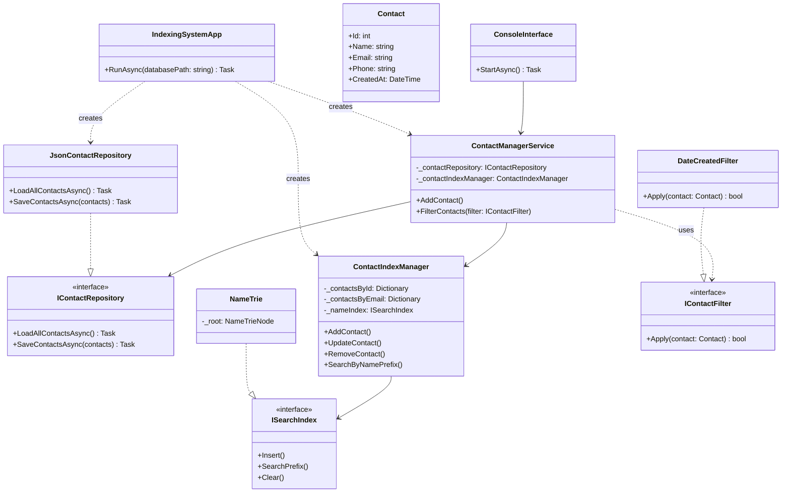

# Modern Contact Indexing System

## 1. System Overview
This is a high-performance, command-line Contact Management System built in **C# / .NET 9.0**. It was engineered to solve the performance bottlenecks associated with traditional linear search operations in contact databases. By implementing a custom in-memory data engine alongside asynchronous JSON storage, the system achieves instant $O(1)$ direct lookups and highly optimized $O(L)$ prefix searches, completely decoupled from the underlying data persistence layer.

---

## 2. System Architecture (UML)



---

## 3. Features, Architecture, and Algorithms

This project was built with a strict adherence to Clean Architecture and modern backend engineering practices.

### Algorithms & Data Structures
* **$O(1)$ HashMaps:** Utilizes dual synchronized `Dictionary<TKey, TValue>` structures to provide instant access to contacts by ID or Email.
* **$O(L)$ Prefix Trie (Prefix Tree):** Replaced standard $O(N)$ `IEnumerable.Where` string matching with a custom Trie data structure. Searching for a name prefix (e.g., "Ad") instantly traverses the tree and yields a mapped `HashSet` of IDs without scanning the entire database.

### OOP & SOLID Principles
* **Single Responsibility Principle (SRP):** Complete separation of concerns. `ConsoleInterface` handles UI, `ContactManagerService` handles business routing, `ContactIndexManager` handles memory state, and `JsonContactRepository` handles disk I/O.
* **Open/Closed Principle (OCP) via Strategy Pattern:** Contact filtering uses the `IContactFilter` interface. Complex filters (like `DateCreatedFilter`) can be passed into the service dynamically. New filters can be added to the system without modifying existing service code.
* **Dependency Inversion Principle (DIP):** High-level modules do not depend on low-level modules. `ContactManagerService` depends on abstractions (`IContactRepository`) injected via the constructor, allowing the JSON storage to be easily swapped for a SQL database in the future.

### Advanced Techniques
* **Asynchronous I/O:** Utilizes `async/await` and `System.Text.Json` to prevent thread-blocking during file read/write operations.
* **Optimized Memory Management:** Uses `TryGetValue` to prevent double-hashing bottlenecks, and relies on natural C# Garbage Collection via unreferenced node dropping for safe Trie deletions.

---

## 4. How to Use the Program

### Prerequisites
* [.NET 9.0 SDK](https://dotnet.microsoft.com/download) installed on your machine.

### Installation & Execution
1. Clone the repository to your local machine:
   ```bash
   git clone <YOUR_GITHUB_REPO_URL>
   ```
2. Navigate into the project directory:
   ```bash
   cd IndexingSystem
   ```
3. Run the application:
   ```bash
   dotnet run
   ```
*Note: A pre-populated `contacts_db.json` file is included in the project root. The `.csproj` file is configured to automatically copy this database to your output directory upon building, allowing you to test the $O(1)$ lookups and Trie searches immediately.*

---

## 5. Video Demonstrations

To see the system in action and understand the backend design, please view the following demonstrations:

* 🎥 **[System Overview & Demo (2 Minutes)](INSERT_YOUR_YOUTUBE_LINK_HERE)** *A quick walk-through of the CLI interface, demonstrating the instant Prefix Search and Strategy Pattern Date Filtering.*

* 🎥 **[Technical Breakdown & Architecture (5 Minutes)](INSERT_YOUR_YOUTUBE_LINK_HERE)** *A deep dive into the code. I explain the performance bottlenecks of legacy indexing, how the custom Prefix Trie was built, and how state is safely synchronized across the in-memory indexes.*
